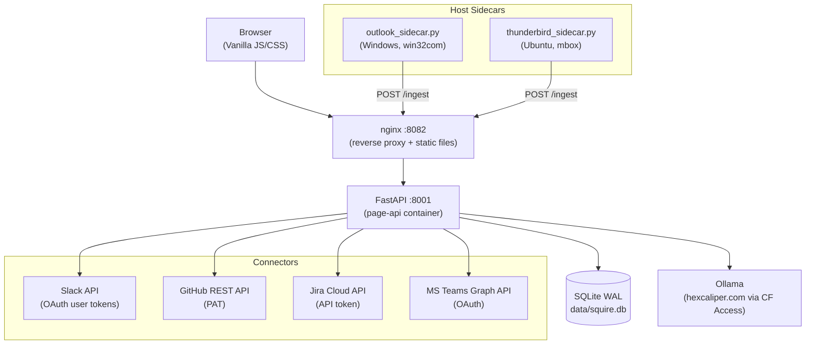
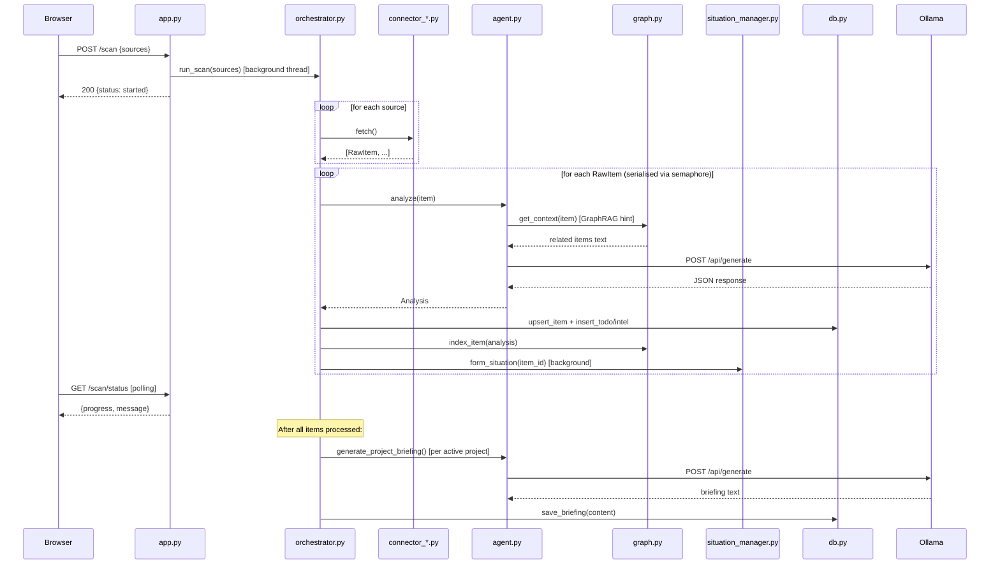
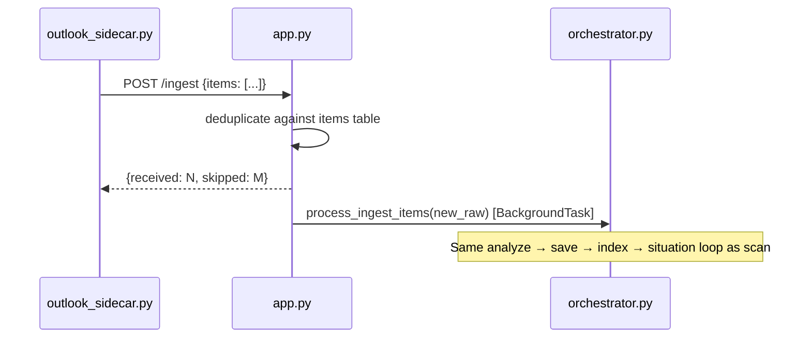
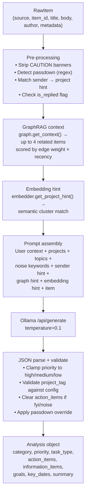
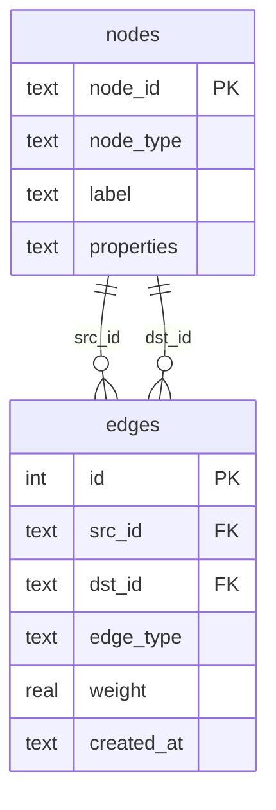
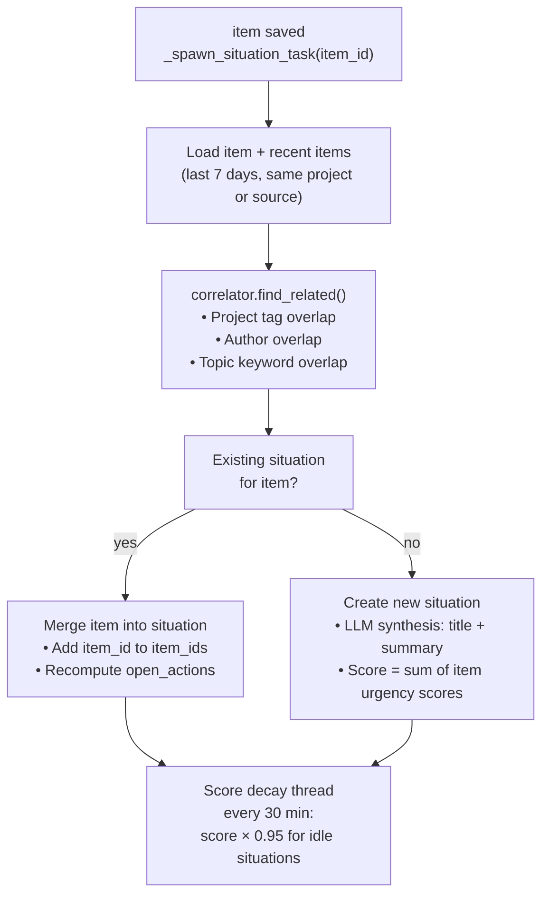
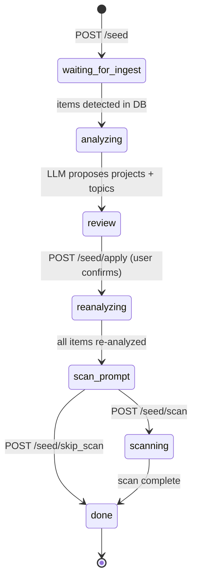
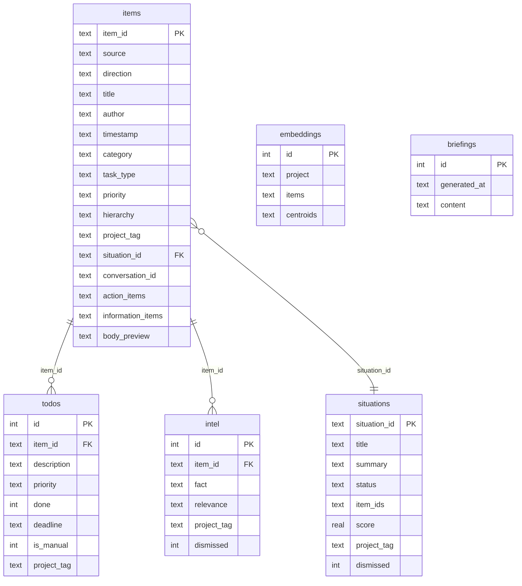
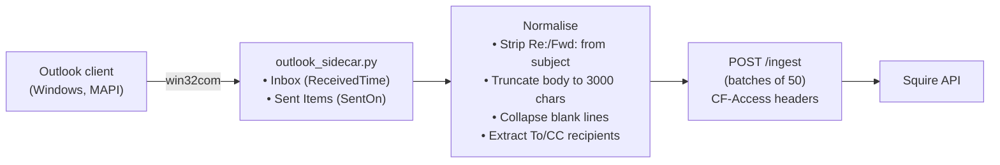
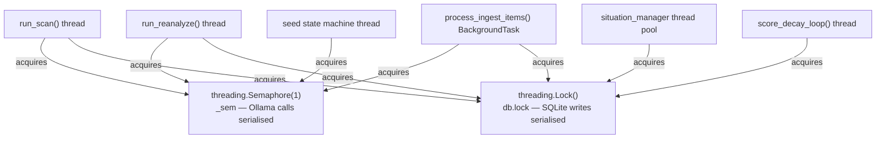

# Hexcaliper Squire — Software Design Document

## 1. Purpose

Squire is a personal ops intelligence layer that sits alongside Hexcaliper. It ingests items from Outlook, Slack, GitHub, Jira, and Microsoft Teams, runs each through a local LLM, and presents a unified action dashboard. No data leaves your infrastructure.

The core problem Squire solves is signal-to-noise at inbox scale. A typical engineer receives hundreds of messages per day across multiple systems. Most of them require no action. A handful are urgent. Squire reads everything, categorises it, extracts concrete action items, and surfaces only what matters — sorted by priority and grouped by workstream.

---

## 2. System Architecture



The entire backend runs in two Docker containers: `page-api` (FastAPI/uvicorn on port 8001) and `page-nginx` (nginx on port 8082). nginx serves the static frontend from `/page/` and reverse-proxies all `/page/api/*` requests to the API container on an internal bridge network — the API port is never exposed to the host directly.

The API is the single source of truth. All state lives in a SQLite WAL database bind-mounted at `data/squire.db`, which survives container restarts and rebuilds. The Ollama LLM endpoint runs on the existing Hexcaliper appliance and is reached through Cloudflare Access using a service token, so no AI inference runs on the Squire host.

Email sources (Outlook and Thunderbird) cannot run inside Docker because they require access to the local mail client's data store. Instead, lightweight Python sidecar scripts run on the host and POST normalised email items to the `/ingest` endpoint, which handles deduplication and queues them for analysis.

---

## 3. Module Map

| Module | Responsibility |
|--------|---------------|
| `app.py` | FastAPI routes, HTTP layer, background task dispatch, project/noise/category learning, briefing builder |
| `orchestrator.py` | Scan, re-analysis, and ingest pipeline execution; Ollama concurrency semaphore; triggers briefing after each run |
| `agent.py` | Prompt construction, Ollama call, JSON response parsing → `Analysis`; per-project briefing generation |
| `db.py` | SQLite schema, connection management, all CRUD helpers |
| `graph.py` | Knowledge graph CRUD, context retrieval, GraphRAG scoring |
| `situation_manager.py` | Cross-source situation formation, LLM synthesis, score decay |
| `embedder.py` | Sentence-embedding centroids per project (all-MiniLM-L6-v2) |
| `correlator.py` | Heuristic item-to-situation matching (project, topic, author overlap) |
| `seeder.py` | Seed state machine (ingest → LLM proposal → review → apply → reanalyze) |
| `models.py` | Pydantic models: `RawItem`, `Analysis`, `ActionItem` |
| `config.py` | Environment variable loading and hot-reload helpers |
| `connector_*.py` | Source-specific fetch logic (one per connector) |

`app.py` is the HTTP boundary — it owns all FastAPI route definitions and delegates all heavy work outward. `orchestrator.py` owns the analysis pipeline and is the only module that calls `agent.py` for LLM inference. `db.py` is the only module that touches SQLite directly; all other modules call its helper functions rather than writing SQL themselves. This separation means the storage layer can be tested or replaced without touching business logic.

---

## 4. Data Flow

### 4.1 Scan pipeline (frontend-triggered)



`POST /scan` returns immediately with `{"status": "started"}`. The actual work happens in a background thread so the HTTP response is never blocked on LLM inference. The browser polls `GET /scan/status` every few seconds to update the progress bar and current-item display.

All connectors are fetched first, then analysis runs sequentially across the combined item list. Items are serialised through a single `threading.Semaphore(1)` — this ensures only one Ollama call is in-flight at a time, which is the correct behaviour for a single-GPU inference server. The semaphore count can be raised in `orchestrator.py` if a multi-GPU setup becomes available.

After each analysis result is saved to the database, two additional operations happen: `graph.index_item()` registers the item, its author, and any conversation or project links as nodes and edges in the knowledge graph; `_spawn_situation_task()` submits a background job to the situation manager to check whether this item belongs to a known situation cluster or warrants creating a new one. Both of these are fire-and-forget from the orchestrator's perspective.

### 4.2 Ingest pipeline (sidecar-triggered)



The ingest path is designed for the sidecar scripts and any external tooling that wants to push items into Squire without triggering a full connector scan. The deduplication step queries the `items` table by `item_id` before any LLM work is done, so re-running a sidecar is always safe — items already in the database are counted as `skipped` and returned in the response immediately. Only genuinely new items are forwarded to `process_ingest_items()`, which runs the same analysis loop as the scan pipeline.

---

## 5. LLM Analysis Pipeline



Each item passes through several enrichment stages before the LLM ever sees it. Pre-processing handles things that do not require AI: stripping mail-client CAUTION banners (external-sender warnings that would confuse the model), deterministically detecting shift passdown notes via regex, checking whether the sender address matches a project's `senders` or `learned_senders` list, and flagging items the user has already replied to. These deterministic checks are intentionally done before the LLM call to reduce prompt ambiguity and avoid the model having to re-derive obvious facts.

The GraphRAG and embedding stages pull in external context. GraphRAG queries the knowledge graph for up to four related items — for example, earlier emails in the same Outlook conversation thread, or recent items tagged to the same project — and formats them as a short context block in the prompt. The embedding stage computes a semantic similarity score against project centroids built from previously-tagged items. Together, these two mechanisms give the LLM enough context to assign correct project tags and hierarchy levels even for terse items that lack explicit keywords.

Prompt assembly builds a single user-turn string containing: the user's name and email, the full project list (with descriptions, manual keywords, learned keywords, channels, and known senders), watch topics, noise keywords, and all the enrichment hints from the previous stages, followed by the item itself. Temperature is set to 0.1 to favour deterministic, structured output.

Post-processing validates and clamps the LLM's JSON response: priority is restricted to `high`/`medium`/`low`, `project_tag` is validated against the configured project names (invented tags are nulled out), `action_items` are cleared for `fyi` and `noise` categories, and the passdown override is applied if the pre-processing step detected a passdown pattern.

### 5.1 Category schema

| Category | `task_type` | Meaning |
|----------|-------------|---------|
| `task` | `reply` | Compose and send a reply |
| `task` | `review` | Read/review a document, PR, or ticket |
| `task` | `null` | General action not fitting either sub-type |
| `approval` | — | Needs explicit sign-off from the user |
| `fyi` | — | Informational; no action required |
| `noise` | — | Irrelevant; suppressed from main view |

The `task_type` field exists because the two most common task sub-types require qualitatively different responses. A `reply` task means the user needs to compose and send a message; a `review` task means they need to read something and form an opinion. The dashboard renders these differently — `task · reply` in red, `task · review` in blue — so they are visually pre-sorted by the kind of cognitive effort required.

### 5.2 Hierarchy tiers

| Tier | Meaning |
|------|---------|
| `user` | Directly addressed — name/email in To/CC, @mention, assignment |
| `project` | Related to an active project but not directly addressed |
| `topic` | Matches a watch topic from `FOCUS_TOPICS` |
| `general` | Everything else |

Hierarchy is distinct from priority. An item can be `hierarchy=project, priority=low` (project-related but not urgent) or `hierarchy=user, priority=high` (directly addressed and time-sensitive). The LLM assigns hierarchy based on the To/CC fields, @mentions, and assignment context in the prompt; the Slack and Teams connectors also pre-compute hierarchy during channel pre-filtering and pass it as a metadata hint to help the model.

---

## 6. Knowledge Graph

### 6.1 Structure



The knowledge graph is a lightweight directed graph stored in two SQLite tables alongside the document tables. It is not a separate graph database — it uses the same `squire.db` file and is queried with plain SQL joins. This keeps the deployment simple while still enabling graph traversal for the GraphRAG feature.

Every time an item is saved, `graph.index_item()` upserts a set of nodes and edges representing the relationships implicit in that item. An `item` node is created for the item itself. A `person` node is upserted for the sender. If the item has a `project_tag`, a `tagged_to` edge is created to the corresponding `project` node. If it has a `conversation_id` (Outlook thread), a `conversation` node is upserted and the item is linked to it via `in_conversation`. When a situation is formed, `in_situation` edges are added between all constituent items.

### 6.2 Edge types and weights

| Edge type | Weight | Created when |
|-----------|--------|--------------|
| `in_conversation` | 1.00 | Two Outlook items share a `ConversationID` |
| `in_situation` | 0.80 | Two items grouped into the same situation |
| `tagged_to` | 0.55 | Item tagged to a named project |
| `authored_by` | 0.40 | Item sent by the same person |

Edge weights reflect the strength of the implied relationship. Items in the same Outlook conversation thread are the most tightly coupled — they are literally the same discussion — so `in_conversation` gets the highest weight. Items in the same situation cluster are strongly related but may be from different sources with only thematic overlap, hence slightly lower. Project co-membership is a weaker signal (many items share a project), and authorship is the weakest (the same person may discuss many unrelated topics).

### 6.3 GraphRAG scoring

Each candidate related item is scored:

```
score = edge_weight × exp(−age_days × ln(2) / 14)
```

The recency decay term uses a 14-day half-life. An item linked by an `in_conversation` edge from 7 days ago scores `1.00 × 0.707 = 0.707`. The same item from 28 days ago scores `1.00 × 0.25 = 0.25`. A project-co-membership link from 3 days ago scores `0.55 × 0.857 = 0.471`. The top four items by score are formatted as a numbered context block and injected into the LLM prompt.

This lets the model answer questions like "has this topic already been discussed?" or "what was the outcome of the last message in this thread?" without storing full message bodies in the graph or re-scanning all history on every inference call.

---

## 7. Situation Layer



Situations are automatically-formed cross-source clusters. The motivating problem is that a single real-world event — a production incident, a project milestone, a policy change — typically generates activity across multiple tools simultaneously: a Slack alert, a GitHub issue, a Jira ticket, and several email threads. Without grouping, these appear as five unrelated items in the dashboard. With situations, they collapse into one entry with a composite urgency score and a unified list of open actions.

After every item is saved, `_spawn_situation_task()` submits a background job to `situation_manager.py`. The correlator examines items from the last seven days that share a project tag, an author, or overlapping topic keywords with the new item. If enough signal is found, the new item is merged into an existing situation (or a new situation is created) and the LLM synthesises a title and summary from all constituent items.

The score decay thread runs every 30 minutes. Situations whose constituent items are all old and have no new activity have their score multiplied by 0.95 per cycle, gradually sinking them below the active threshold. A new item arriving in an existing situation resets the decay clock and rescores the cluster upward.

---

## 8. Seed Workflow State Machine



The seed workflow solves the cold-start problem. When Squire is first deployed, the project list is empty, so the LLM has no project context to tag items against. The seed workflow inverts this: it ingests existing data first, then uses a map-reduce LLM pass to discover the project structure from that data, rather than requiring the user to configure projects from scratch.

In the `analyzing` state, Squire samples the stored items in batches and asks the LLM to extract recurring themes, project names, and focus topics from each batch. The results are reduced into a deduplicated candidate list. In the `review` state, the user sees this list in the UI and can edit names, merge duplicates, or delete irrelevant entries before confirming.

Once applied, all stored items are re-analyzed with the newly-configured project list. This is the most expensive step — it runs the full LLM pipeline over every item in the database — but it only happens once per seed run. After re-analysis completes, the user is prompted to run a live connector scan to pull in fresh items with the now-fully-configured system.

---

## 9. Database Schema



The schema follows a hub-and-spoke pattern centred on the `items` table. Every `todo` and `intel` row points back to the item it was extracted from via `item_id`, which means deleting or re-analyzing an item can cleanly cascade to its derived rows. Items point to `situations` via a nullable `situation_id` foreign key — the relationship is many-to-one from item to situation, but the situation table also stores a JSON `item_ids` array for fast lookup in the reverse direction without a join.

The `action_items`, `information_items`, `goals`, `key_dates`, and `references` columns on the `items` table store JSON arrays. This avoids the need for separate child tables for these LLM-extracted lists while keeping the schema flat enough to query efficiently. The `todos` and `intel` tables exist as first-class rows (rather than just JSON columns) because they need to be independently queried, sorted, filtered, edited, and deleted by the user.

The `embeddings` table stores sentence-embedding centroids per project. Each row holds the centroid vector, a list of the item IDs that contributed to it, and per-cluster counts. This supports the embedding hint in the LLM prompt — Squire can compute the cosine similarity between a new item's embedding and each project centroid before the LLM call, injecting the nearest project name as a hint.

All tables share the same SQLite WAL connection managed by `db.conn()`. WAL mode allows concurrent reads (the browser polling status while a scan runs) without blocking writes. All writes are serialised through `db.lock`, a module-level `threading.Lock`, to prevent interleaved writes from the scan thread, ingest background task, and situation manager.

---

## 10. Project Learning

When a user tags an item to a project (`POST /analyses/{item_id}/tag`), a background job:

1. Updates `project_tag` on the analysis record.
2. Calls the LLM to extract 5–10 characteristic keywords from the item.
3. Merges keywords into `project.learned_keywords` (capped at 100).
4. Extracts all email addresses from From/To/CC fields.
5. Merges addresses into `project.learned_senders` (capped at 50, excluding the user's own address).
6. Saves updated settings and hot-reloads config.

Project learning creates a positive feedback loop. Every tagging action makes the next scan more accurate by expanding the keyword and sender signals the LLM receives in its prompt. Learned keywords also feed into the Slack and Teams connector pre-filters, which run before the LLM and can skip entire channels of irrelevant content without spending an inference call. Learned senders trigger deterministic pre-tagging — if an incoming item's sender or any recipient address matches a known sender, the project tag is applied before the LLM even runs.

The caps (100 keywords, 50 senders) prevent unbounded growth. Both lists use FIFO eviction — new entries displace the oldest when the cap is reached — so the model reflects recent tagging behaviour rather than accumulating stale history.

---

## 11. Noise Learning

When a user marks an item as noise (`POST /analyses/{item_id}/noise`), a background job:

1. Sets `category="noise"`, `priority="low"`, `has_action=false`.
2. Extracts keywords via LLM.
3. Merges into `config.NOISE_KEYWORDS` (capped at 200).

Noise learning is the inverse of project learning. Marking something as noise teaches Squire which topics are irrelevant to the user without requiring them to write filter rules. The extracted keywords are included in every subsequent LLM prompt — the model is explicitly told "if content is primarily about these topics with no direct relevance to the user, set `category=noise`". On Slack scans, messages that match only noise keywords (and no positive project/topic signal) are silently dropped before the LLM step entirely.

This makes noise learning asymmetric with project learning in an intentional way: a noise match will not override a direct-address or project signal. An item that is both about a noisy topic and directly addressed to the user will still be categorised correctly as a `task`.

---

## 12. Category Learning

When a user changes an item's category via `PATCH /analyses/{item_id}` or marks it irrelevant via `POST /analyses/{item_id}/noise`, Squire runs background keyword extraction and merges the results into the appropriate per-category list in config:

| User action | List updated |
|-------------|-------------|
| Change to `task` | `TASK_KEYWORDS` |
| Change to `approval` | `APPROVAL_KEYWORDS` |
| Change to `fyi` | `FYI_KEYWORDS` |
| Change to `noise` / mark irrelevant | `NOISE_KEYWORDS` |

All four lists are injected into every subsequent LLM prompt as labelled context blocks — for example, "Task indicators: agile, sprint, review PR". This creates a per-category positive-signal loop alongside the existing noise-suppression loop: marking items teaches the model both what to suppress and what to emphasise for each category.

`fyi` is used as the default category when no strong indicators exist for `task`, `approval`, or `noise`. This reflects its role as the catch-all for informational items that do not require action.

---

## 13. Assignment Learning

When the LLM identifies that an action item belongs to someone other than the user (i.e., `owner` is not `"me"`), Squire attempts to resolve the owner name to an email address by scanning the item's `To` and `CC` headers using an RFC-style name/email parser. If found, the action item is automatically marked `status="assigned"` and `assigned_to=<resolved email>`.

If the user manually overrides an assignment, that override is preserved through re-analysis cycles: before deleting stale todos during reanalysis, Squire snapshots `assigned_to` and `status` values for existing rows, then re-applies them after the new todos are inserted. This means a manual reassignment is never lost by a routine reanalyze run.

Assignment corrections — items where the user changed the assignment — are fed back into the LLM as few-shot examples in `config.ASSIGNMENT_CORRECTIONS`. These are formatted as prompt context: "When a message is addressed To John Johnson and asks them to complete a task, set owner to John Johnson." The model learns from these examples on the next scan or ingest, without any retraining.

---

## 14. Project Briefing

After every scan or reanalyze run, Squire auto-generates a project briefing and caches it in the `briefings` table. The briefing is also available on demand via `POST /briefing/generate`.

The briefing is scoped to efficiency: only projects (and the untagged pool) that have had new intel, situation, or todo activity since the last briefing are included in the LLM call. Inactive projects are silently omitted, keeping the prompt token count proportional to what has actually changed.

For each active project, `generate_project_briefing()` in `agent.py` synthesises a short prose summary from the available intel facts, open situation titles and statuses, and open action item descriptions. The result is stored as a JSON document with a `sections` array, one entry per project:

```json
{
  "generated_at": "2026-03-27T14:00:00+00:00",
  "sections": [
    {
      "project": "Alpha",
      "summary": "Two open situations pending...",
      "situations": [{"situation_id": "...", "title": "..."}],
      "todos": [{"doc_id": 42, "description": "...", "priority": "high"}]
    }
  ]
}
```

The "Current State" tab in the UI displays the cached briefing as a formatted newsletter-style view: one card per project section, with the prose summary followed by linked situations (clicking jumps to the Situations tab) and a priority-sorted list of open actions. A "↺ Regenerate" button triggers an on-demand rebuild and polls until the new content arrives.

---

## 15. Outlook Sidecar



The sidecar connects to the running Outlook process via COM automation (`win32com.client.Dispatch("Outlook.Application")`), accesses the MAPI namespace, and reads from both the default Inbox (folder ID 6) and Sent Items (folder ID 5). Both folders use a `Restrict` call to pre-filter by timestamp before iterating, which avoids loading the entire mailbox into memory.

Fetching the Sent Items folder is important for LLM context. When the model sees a received email, knowing whether the user already replied — and what the reply said — fundamentally changes how the item should be categorised. A thread where the user has already sent a detailed response is `fyi` or `done`, not `task · reply`. The `direction` field (`received`/`sent`) and `conversation_id` field enable the knowledge graph to link these items and surface the sent reply as graph context during the next analysis of a related item.

Bodies are truncated to 3000 characters and run through a blank-line collapse (`re.sub(r'\n{3,}', '\n\n', ...)`) to reduce token usage without losing meaningful content. Subject lines have `Re:`, `Fwd:`, and similar prefixes stripped to normalise `conversation_topic` for graph matching. Items are POSTed in batches of 50 to stay well under nginx's default body-size limit.

---

## 16. Concurrency Model



Squire runs several concurrent threads against a shared SQLite database and a shared Ollama endpoint. Two independent locks coordinate access to these shared resources.

`_sem` (a `threading.Semaphore(1)`) serialises all Ollama calls. Every code path that calls `agent.analyze()` wraps it in `with _sem:`. This prevents multiple LLM requests from being submitted simultaneously to a single-GPU inference server, which would cause request queuing at Ollama and unpredictable latency. The semaphore count is a single constant in `orchestrator.py` and can be raised to match the number of available GPUs without changing any calling code.

`db.lock` (a `threading.Lock()`) serialises all SQLite write operations. SQLite's WAL mode already allows concurrent reads to proceed while a write is in progress, so reads do not need to acquire this lock. Only operations that call `INSERT`, `UPDATE`, `DELETE`, or `UPSERT` acquire `db.lock`. Callers that need atomicity across multiple write operations — for example, upsert an item then insert a todo — acquire the lock themselves and call the `db.*` helpers within a single `with db.lock:` block.

All long-running background jobs (`run_scan`, `run_reanalyze`, `process_ingest_items`) check `scan_state["cancelled"]` before processing each item and exit cleanly after the current item finishes. This means a cancel request is always honoured within one item's worth of latency (typically a few seconds) rather than requiring a process kill.
